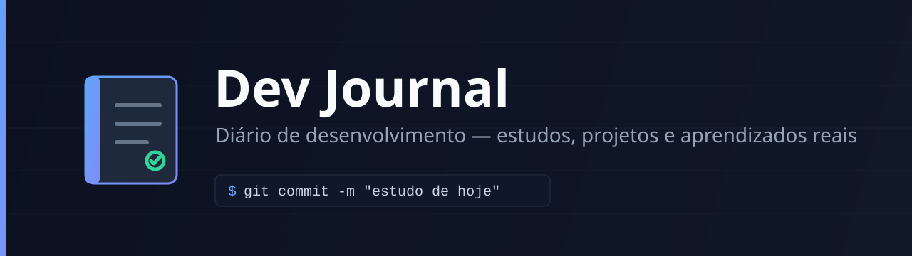

<div align="center">



# Dev Journal

Diário de desenvolvimento para registrar estudos, projetos, desafios e aprendizados reais de forma organizada.

<br/>


</div>

---

## Sobre

A proposta deste repositório é facilitar o hábito de documentar a evolução como desenvolvedor. As entradas são criadas por um workflow manual do GitHub Actions e salvas automaticamente em arquivos mensais dentro da pasta `journal/`.

O projeto automatiza somente a formatação e o armazenamento dos registros. Cada entrada representa uma atividade realmente realizada.

## Índice

- [Funcionalidades](#funcionalidades)
- [Como registrar uma atividade](#como-registrar-uma-atividade)
- [Exemplo de entrada](#exemplo-de-entrada)
- [Estrutura](#estrutura)
- [Tecnologias](#tecnologias)
- [Objetivo](#objetivo)
- [Autor](#autor)

## Funcionalidades

- Registro manual pela aba Actions
- Organização automática por mês
- Histórico em arquivos Markdown
- Campos para assunto, resumo, aprendizado e próximo passo
- Validação básica dos dados
- Commit automático apenas quando uma entrada real é enviada

## Como registrar uma atividade

1. Abra a aba **Actions** do repositório.
2. Selecione **Registrar atividade no Dev Journal**.
3. Clique em **Run workflow**.
4. Preencha os campos solicitados.
5. Execute o workflow.

A entrada será adicionada em um arquivo no formato:

```
journal/2026-08.md
```

## Exemplo de entrada

```markdown
## 01/08/2026 — ASP.NET Core

**Resumo:** Implementei autenticação JWT na API.

**Aprendizado:** Entendi melhor a diferença entre access token e refresh token.

**Próximo passo:** Criar testes de integração para o fluxo de login.
```

## Estrutura

```
.
├── .github/
│   └── workflows/
│       └── add-entry.yml
├── assets/
│   └── banner.svg
├── journal/
│   └── README.md
├── scripts/
│   └── add_entry.py
└── README.md
```

## Tecnologias

- GitHub Actions
- Python 3
- Git
- Markdown

## Objetivo

Criar um histórico verdadeiro da evolução técnica, facilitando revisões, organização dos estudos e a apresentação do progresso em projetos.

## Autor <a name="autor"></a>

- **Mateus de Lima Lins Prestes**
- Desenvolvedor Back-end / Full Stack
- GitHub: https://github.com/TeuzLins
- LinkedIn: https://www.linkedin.com/in/mateus-de-lima-lins-prestes-304a812b7/

<table>
  <tr>
    <td align="center">
      <a href="https://github.com/TeuzLins">
        <br />
        <sub><b>Teuz Lins</b></sub>
      </a><br />
      <sub>Back-end Developer</sub>
    </td>
  </tr>
</table>
